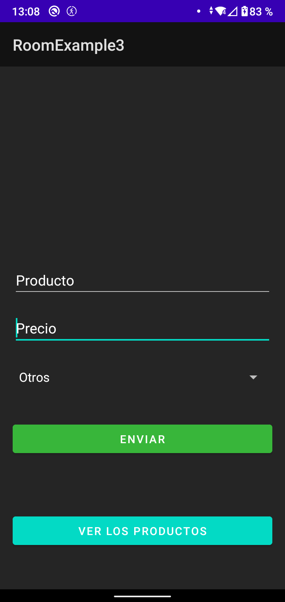
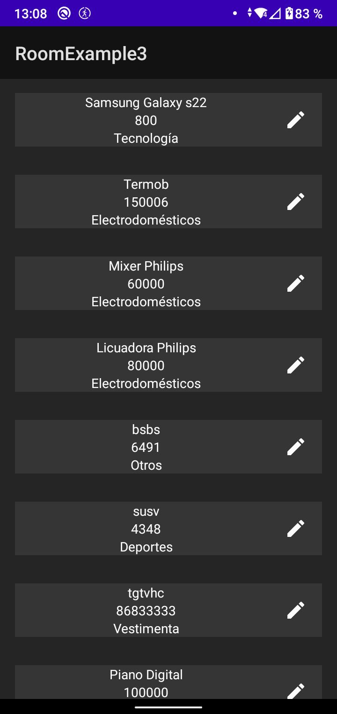
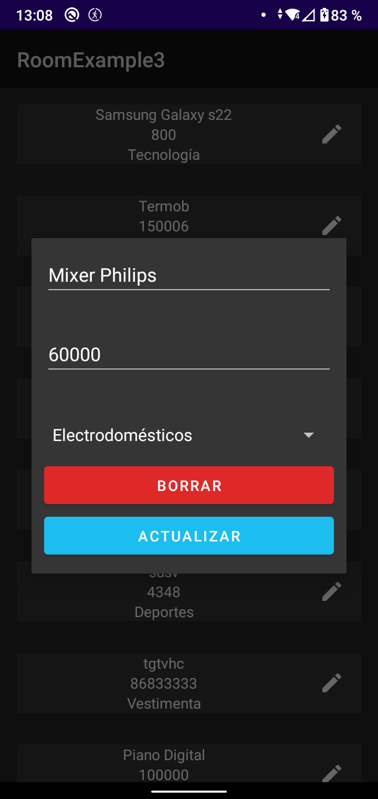

# CRUD Room app

Aplicación que realiza las consultas basicas a una base de datos SQL, la aplicación no busca ser estéticamente atractiva, solo es para practicar el uso de Room.

Elementos utilizados en esta aplicación:
* Spinner para hacer lista de opciones desplegables
* RecyclerViews con funciones lambda
* Room para usar una BBDD SQLite
* Principio de Responsabilidad Única y Principio Abierto-Cerrado

|                            Pantalla principal                             |                                 Resultado                                  |
|:-------------------------------------------------------------------------:|:--------------------------------------------------------------------------:|
|  |  |

|  |